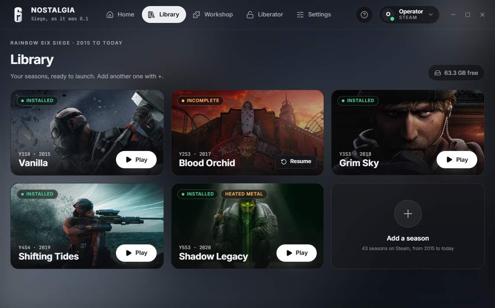
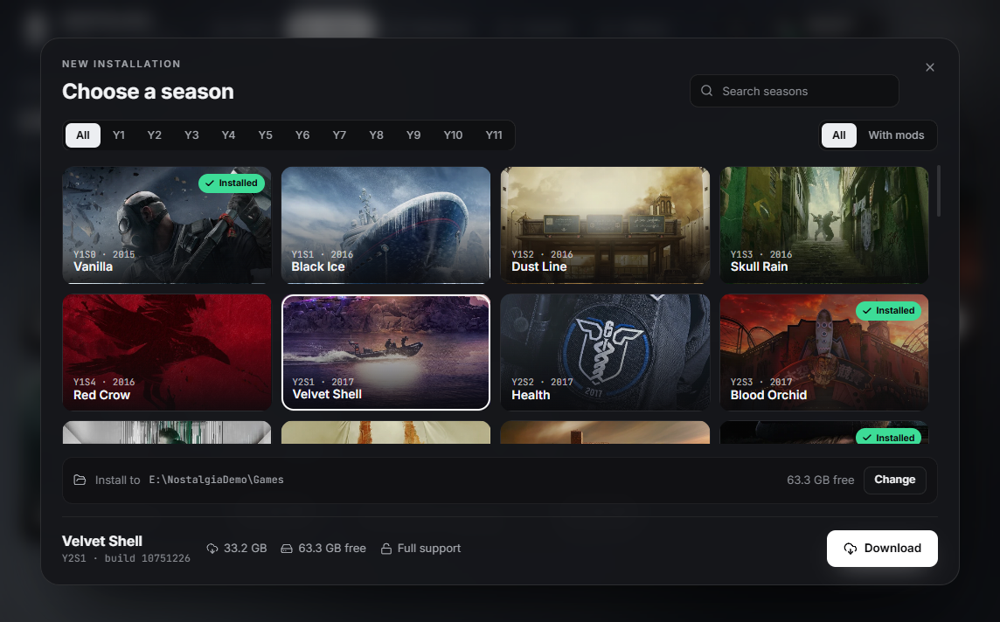
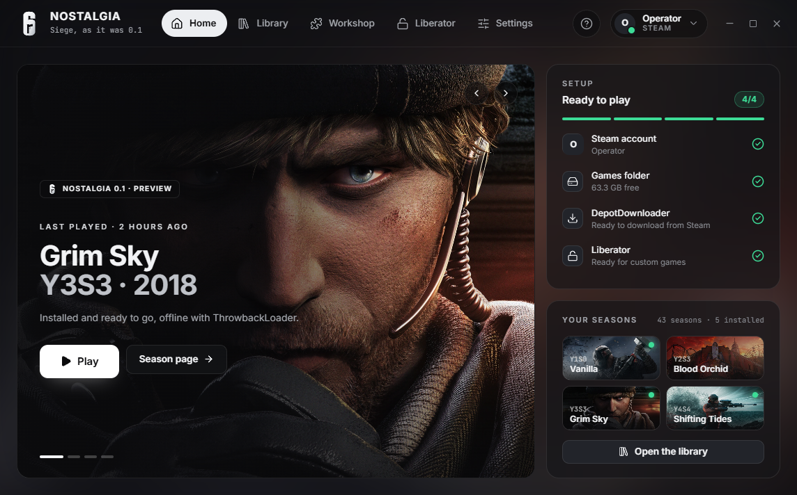
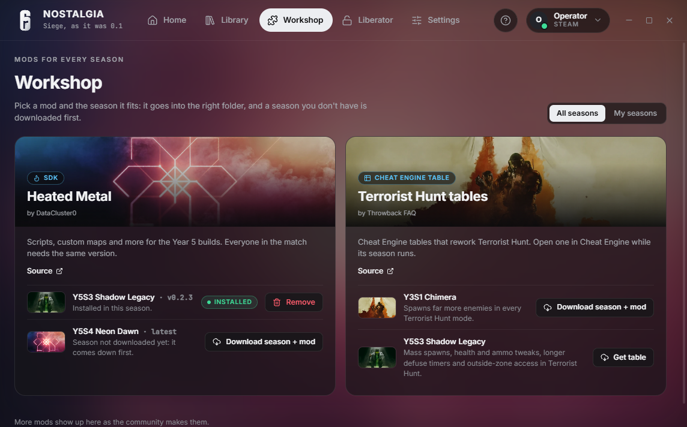
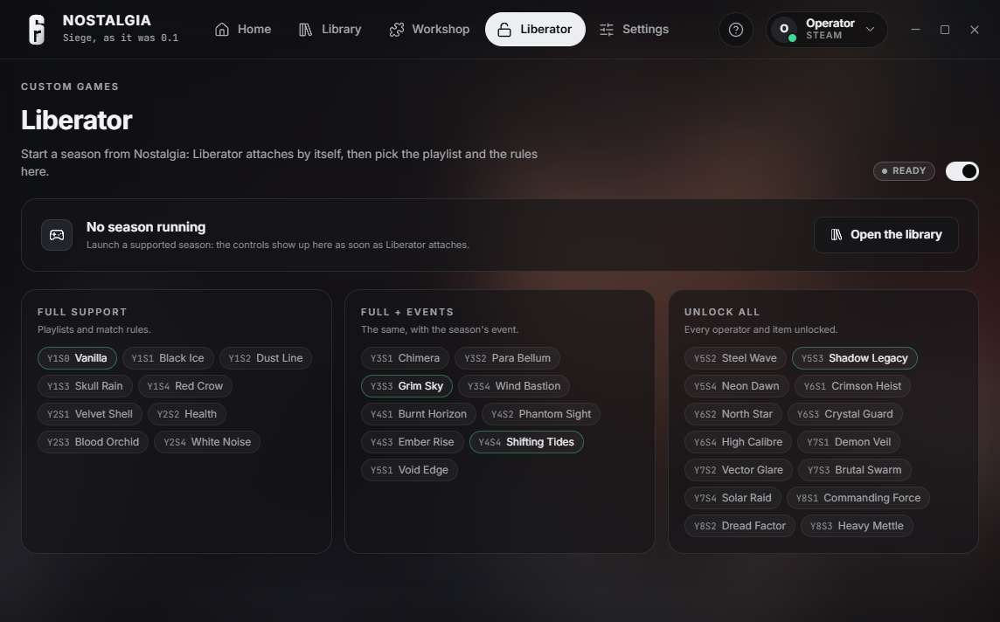
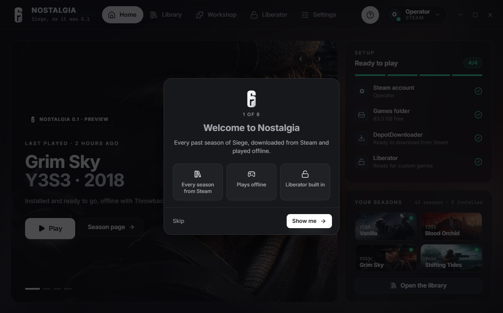

<div align="center">
  
  <h1>Nostalgia</h1>
  <p>
    <b>Every past season of Rainbow Six Siege, one click away.</b><br />
    Download any build from 2015 to today with your own Steam account, add mods, and play it offline.
  </p>
  <p>
    
    
    
    <a href="https://ko-fi.com/fialss"></a>
  </p>
  
</div>

> [!WARNING]
> Nostalgia is still in development: expect bugs and rough edges. It is a fan project, not affiliated with, endorsed by or sponsored by Ubisoft or Valve.

## A look around

<table>
  <tr>
    <td width="50%"></td>
    <td width="50%"></td>
  </tr>
  <tr>
    <td><b>Your library.</b> Every season on this PC as a card, with Play right on it. Downloads show their progress on the card.</td>
    <td><b>Add a season with +.</b> 43 builds from Vanilla to last season, with the size and the free space before anything downloads.</td>
  </tr>
  <tr>
    <td></td>
    <td></td>
  </tr>
  <tr>
    <td><b>Pick up where you left off.</b> The season you played last waits on the home page with its Play button.</td>
    <td><b>Workshop.</b> Mods listed by season and version, installed into the right folder; a season you don't have is downloaded first.</td>
  </tr>
  <tr>
    <td></td>
    <td></td>
  </tr>
  <tr>
    <td><b>Liberator built in.</b> Playlists, events and match rules for local custom games, connected to the game by itself.</td>
    <td><b>A guide for the first run.</b> Eight short steps, from signing in to your first match.</td>
  </tr>
</table>

## What it does

- **Every season from Steam.** Sign in with the Steam app's QR code (or name, password and Steam Guard) and download any build with your own account. The account must own Rainbow Six Siege.
- **Plays offline.** Each download gets ThrowbackLoader, which stands in for Ubisoft Connect, and your in-game name is set for you.
- **Liberator.** Fetched on its own and attached to the running game: pick the playlist and the rules from the app.
- **Workshop.** Heated Metal for the Year 5 builds, Cheat Engine tables for Terrorist Hunt, more as the community makes them.
- **One sensitivity everywhere.** Take your sensitivity from any Siege profile on the PC, the current game included, and every season gets the settings it has.
- **Stays out of the way.** Closing keeps it in the tray while downloads go on; starting a season steps the window aside.

Season folders use Operation Throwback's names (`Y5S3_ShadowLegacy`), so a folder of seasons from Throwback Launcher is recognised as it is.

## Get it

Download the portable exe or the installer from **Releases**. To build it yourself you need Node 22 or newer:

```sh
git clone https://github.com/Fialsss/NostalgiaR6.git
cd NostalgiaR6
npm install
node node_modules/electron/install.js   # when npm skipped Electron's download
npm run dev                             # or: npm run dist for the installer and the portable exe
```

## Support

Nostalgia is free and always will be. If it brought back some good memories, you can buy me a coffee:

<a href="https://ko-fi.com/fialss"></a>

## Credits

**Nostalgia is made by [Fialsss](https://github.com/Fialsss).** It builds on other people's work, fetched at runtime and never shipped in this repository:

- [Operation Throwback](https://github.com/xeralin/ThrowbackLauncher) and Throwback Launcher by Xeralin: the season list, Liberator, and the season key art shown in the app
- [ThrowbackLoader](https://github.com/xeralin/ThrowbackLoader) by Xeralin (GPL-3.0)
- [Heated Metal](https://github.com/DataCluster0/HeatedMetal) by DataCluster0 (MIT)
- [Throwback FAQ](https://github.com/xeralin/ThrowbackFAQ) by Xeralin: the Cheat Engine tables
- [DepotDownloader](https://github.com/SteamRE/DepotDownloader) by SteamRE (GPL-2.0)

Rainbow Six Siege, its logo and its artwork belong to Ubisoft.

## License

Nostalgia is Copyright (C) 2026 **Fialsss**, released under [GPL-3.0](LICENSE) with one additional term (section 7(b)): **copies and works based on Nostalgia must keep the notice "Based on Nostalgia by Fialsss — https://github.com/Fialsss/NostalgiaR6"** in their documentation and in their credits or about screen. Details in [NOTICE.md](NOTICE.md).
