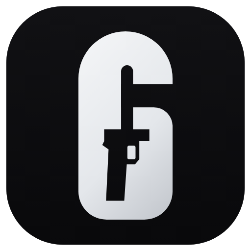

<p>
  
  <b>Nostalgia</b><br>
  Download, mod and launch past seasons of Rainbow Six Siege from one window.<br>
  Not affiliated with, endorsed by, or sponsored by Ubisoft or Valve.
</p>
<br clear="left">

## What it does

- **Every season, from Steam.** Pick any build from Vanilla (2015) to last season and Nostalgia downloads it with your own Steam account through DepotDownloader. Sign in with the Steam app's QR code, or with name, password and Steam Guard. The account must own Rainbow Six Siege.
- **Plays offline.** Each download gets ThrowbackLoader, which stands in for Ubisoft Connect, and a Play button. Your in-game name is set for you.
- **Liberator built in.** Liberator (from Operation Throwback) unlocks playlists, events and match rules in local custom games. Nostalgia fetches it and connects it to the running game: pick the playlist and the rules from the app.
- **Mods where they belong.** Heated Metal installs into the Year 5 seasons it supports; Cheat Engine tables download next to their season.
- **One sensitivity everywhere.** Take your sensitivity and input options from any Siege profile on the PC, including the current game, and apply them to every season. Each season only takes the settings it has.

Season folders use Operation Throwback's names (`Y5S3_ShadowLegacy`), so a folder of seasons from Throwback Launcher is recognised as it is.

## Run it

Download the portable exe or the installer from the releases. From source you need Node 22 or newer:

```sh
git clone https://github.com/Fialsss/NostalgiaR6.git
cd NostalgiaR6
npm install
node node_modules/electron/install.js   # when npm skipped Electron's download
npm run dev
```

`npm run dist` builds the installer and the portable exe into `dist`.

## Credits

Nostalgia is glue around other people's work, fetched at runtime and never shipped here:

- [Operation Throwback](https://github.com/xeralin/ThrowbackLauncher) and Throwback Launcher (Xeralin): the manifest list, Liberator, and the season key art shown in the app
- [ThrowbackLoader](https://github.com/xeralin/ThrowbackLoader) (Xeralin, GPL-3.0)
- [Heated Metal](https://github.com/DataCluster0/HeatedMetal) (DataCluster0, MIT)
- [Throwback FAQ](https://github.com/xeralin/ThrowbackFAQ) (Xeralin): the Cheat Engine tables
- [DepotDownloader](https://github.com/SteamRE/DepotDownloader) (SteamRE, GPL-2.0)

Rainbow Six Siege and its artwork belong to Ubisoft.

## License

GPL-3.0-or-later. See [LICENSE](LICENSE).
